# Numeric integration methods

Two projects by the same author searched for Runge-Kutta coefficients that do better than the textbook ones. `Novel-Numerical-Integration-Methods` (2025) tried to generate new explicit Butcher tables with a neural generator, a surrogate model and evolutionary search, scored in float64 on generated ODEs. The rk run (2026) is an autonomous search, run in a container, for coefficients that do well in Q15 fixed point with floor rounding on a modeled Cortex-M0+. A language model steers it through a JSON directive that can only narrow the search, and code does all the scoring.

In float64, [established methods were more accurate in both projects](https://jgoetzmann.github.io/numeric-integration-methods-exploration/claims.html#U1). In the rk run, float64 rk4 was 1,992x to 420,975x more accurate than the searched champion at the same cycle budget. The 2025 half is weak evidence: Dormand-Prince and RK4 had the lowest mean error in that benchmark, but against copies of themselves, random tables and truncated methods.

Inside Q15 with floor rounding, at a 65,536-cycle budget on the analytic cost model with magnitude weighting, the rk run found [a three-stage dyadic method with 2.95x lower held-out error](https://jgoetzmann.github.io/numeric-integration-methods-exploration/claims.html#R1) than the best of eight classical methods. That figure comes from epoch 1, whose cost model a later trace found had rk4 and rk38 in the wrong order, and epoch 2 has not re-measured it. It also moves with the cost basis and with how the held-out problems are weighted.

An audit of the 2025 project in September 2026 credits its harness and benchmark, and finds that [its claimed rediscovery of RK4 and Dormand-Prince does not hold](https://jgoetzmann.github.io/numeric-integration-methods-exploration/claims.html#N2): its search started from those two tables.

**Site:** [jgoetzmann.github.io/numeric-integration-methods-exploration](https://jgoetzmann.github.io/numeric-integration-methods-exploration/)

## Results

Q15 is a 16-bit integer standing for a fraction between minus one and one, and floor rounding means every Q15 multiply rounds toward minus infinity. Every method gets the same 65,536 modeled cycles per problem, so a cheaper step buys more steps. The analytic cost model prices coefficient arithmetic only; the traced whole-step count prices every instruction of the compiled step except the derivative routine's body. The archive sorts methods into cells by order, stage count and cost band, and a cell's elite is its method with the lowest error on four held-out problems. No optimizer reads those problems, but elites are picked on them. Magnitude weighting combines the four held-out errors as an RMS, so problems with small errors count for little. The two other weightings divide each problem's error before the RMS: median-anchor weighting by the median classical error on that problem, which counts the four equally, and reference-norm weighting by the problem's zero-state error, which puts extra weight on rc_thermal.

### The rk run

Inside Q15 fixed point with floor rounding, at a 65,536-cycle budget, on the analytic `m0plus_fast` cost model with magnitude weighting, [the three-stage method `11e898cb` has 2.95x lower held-out error than midpoint](https://jgoetzmann.github.io/numeric-integration-methods-exploration/claims.html#R1), the best of eight classical methods. This is an epoch-1 result on the cost model that the trace later found had rk4 and rk38 in the wrong order; epoch 2 scores under a corrected model and has not re-measured it. Elites were picked on held-out error among 141,364 archived tableaus, so the four held-out problems act as a selection set and the lead carries winner's-curse bias.

The 2.95x is an RMS over four problems. The champion has lower error than midpoint on three of them and higher on pendulum, and much of the gap comes from rc_thermal, where every classical method stalls near a quantization floor. There are six combinations of cost basis and weighting. In two, both analytic, the champion stays ahead whichever held-out problem is dropped: 2.95x under magnitude weighting and 3.36x under reference-norm weighting. On the traced whole-step basis the lead falls to 1.01x under magnitude weighting, which dropping one held-out problem overturns (lowest 0.614x), and it is 1.84x under reference-norm weighting (lowest 0.604x). Under median-anchor weighting it is 1.1x on the analytic basis (lowest 0.814x) and 0.0494x on the traced one, a figure the run's own analysis reads as the weighting magnifying pendulum, not as the champion losing by that factor. The lead is also a floor-rounding result. Under round-to-nearest, at the same budget and cost model and with no extra cycles charged for the rounding, rk38, one of the four classical methods run under both rounding modes, reaches 0.0263 held-out error, below the champion's 0.0286 under floor rounding.

Under the same conditions and with the same selection bias, [each of the 16 discovered elites](https://jgoetzmann.github.io/numeric-integration-methods-exploration/claims.html#R2) that hold one of the archive's 18 occupied cells has lower held-out error than all eight classical methods, whatever their cost. The closest, a four-stage elite at 30 cycles per step, has 0.0836 against midpoint's 0.0844. Classical methods hold the other 2 cells. Re-ranking all 141,364 archived tableaus on the analytic basis, no classical method ranks above the champion under any of the three weightings, but the champion's own rank moves with the weighting: 1 under magnitude weighting, 15 under reference-norm weighting and 9,974 under median-anchor weighting.

On eight problems chosen after the search began, [the best of the three discovered methods tried had lower Q15 error](https://jgoetzmann.github.io/numeric-integration-methods-exploration/claims.html#R4) than the best of the five classical methods run (euler, heun2, midpoint, rk4, rk38) on 4 of 5 non-stiff problems. The fixed champion by itself had the lower error on 3 of the 5. No optimizer or model saw these problems and the champion was fixed before they ran, but people chose them after the search began. On the stiff `robertson_scaled` problem every discovered method overflowed, and so did rk4 and rk38; euler, heun2 and midpoint finished, midpoint with the lowest error.

[In float64, rk4 is far more accurate than the champion](https://jgoetzmann.github.io/numeric-integration-methods-exploration/claims.html#R5). At the step count the 65,536-cycle budget gives each method, the champion's float64 error was 1,992x to 420,975x rk4's on the 7 validation problems where both finish. That sets an order-2 method against an order-4 one, and classical order-2 methods trail float64 rk4 by a similar margin in the same runs. Two wider comparisons, run on the seven search and held-out problems rather than the validation set, measure the arithmetic rather than the coefficients. Float64 rk4 had lower error than every Q15 run, classical and discovered alike, in 56 of 56 fixed-step comparisons at identical step counts. At tolerances of one Q15 least significant bit, the most accurate library solver, Radau on each of those problems, was a median 519x more accurate than the most accurate Q15 run. Dormand-Prince (SciPy RK45) was among the library solvers but was never the most accurate one, and it never ran against the champion in the same arithmetic. The search optimized for Q15 floor arithmetic on purpose.

A host-side audit compiled the step with GCC 13.2.1 and traced it under an emulator. [The compiled step agreed with the Python evaluator bit for bit in 144 of 144 cases](https://jgoetzmann.github.io/numeric-integration-methods-exploration/claims.html#R7), 25 of them overflow cases where both stop at the same operation, and it showed that the `m0plus_fast` cost model the archive was scored under put rk4 and rk38 in the wrong order. The run froze epoch 1 and started epoch 2 under a corrected cost model instead of rescoring the old archive. The emulator is instruction-accurate, not cycle-accurate, and nothing was measured on a physical chip.

[The search cannot edit its own scorer](https://jgoetzmann.github.io/numeric-integration-methods-exploration/claims.html#R11). The harness is mounted read-only, and a sha256 over the pinned files (10 in epoch 1, 14 since epoch 2) is checked at every start and stored in every record. 91 golden and canary cases must pass before any cycle runs, and the suite collected 1,908 tests on 2026-09-23.

[Epoch 1 ran from 2026-08-29 to 2026-09-10](https://jgoetzmann.github.io/numeric-integration-methods-exploration/claims.html#R12): 3,931 search cycles over 13 days of archive and 141,364 scored records, all under the epoch-1 hash apart from 21 written minutes before that pin was set. Autonomous here means that no person chose candidates or scores and the pinned scorer never changed. It does not mean free of human operation: the runner started 24 times, including restarts to deploy changes to the unpinned harness code. Epoch 2 started on 2026-09-17 under the new verifier hash, stopped late that day, and nothing restarted it until 2026-09-23. The watchdog now resumes the stops it makes itself, and after a reboot a person starts the run with one command.

### The 2025 ML project

[The project built an evaluation harness](https://jgoetzmann.github.io/numeric-integration-methods-exploration/claims.html#N9) that runs end to end for explicit tables: a generic Butcher-table stepper, a generator covering 11 ODE families including stiff ones, a SciPy reference solver, parallel scoring and 16 trial configurations. Its source tree holds 10,279 lines of Python across 47 files. Two of its parts produced artifacts: the stepper runs only the explicit part of a table, and the reference solver covers 5 of the 6 test families and 5 of the 11 training families. Its main conclusions from 2025 are what did not hold.

[Across 12 methods and 10,000 generated ODEs (8,113 scorable), Dormand-Prince had the lowest mean error (0.0791) and RK4 the next lowest (0.14)](https://jgoetzmann.github.io/numeric-integration-methods-exploration/claims.html#N1). The error is the mean of each ODE's maximum error, which a few outlier ODEs dominate. The trial entries were copies of RK4 and Dormand-Prince or random tables, and the Gauss-Legendre entries ran truncated through a stepper that ignores the implicit part of a table. The reference solutions came from SciPy RK45, an adaptive Dormand-Prince solver, so the Dormand-Prince entry is measured against a reference built on its own tableau.

[The claimed rediscovery of RK4 and Dormand-Prince does not hold](https://jgoetzmann.github.io/numeric-integration-methods-exploration/claims.html#N2). RK4 was placed in the starting population of the four-stage runs and Dormand-Prince in that of the seven-stage run. The genetic operators ran and the population moved off the seed, but the composite score is clipped at 1: all 10,000 rows of the one training log score 1, and the best-table tracker replaces the saved table only on a strictly higher score, so the seed stayed.

[The claim that gradient descent collapsed into local minima does not hold either](https://jgoetzmann.github.io/numeric-integration-methods-exploration/claims.html#N4). The generator that proposes tables was never trained: its optimizer was created and never stepped, and a random generator that resets its seed to 42 filled every empty slot. The only gradient descent in the project trained a surrogate model, and nothing in the training loop reads its predictions.

### What neither project tested

[Neither project's comparison was blind](https://jgoetzmann.github.io/numeric-integration-methods-exploration/claims.html#U2). In the rk run the language model is shown held-out errors and elites are picked on them, so the nearest thing to an independent check is the out-of-sample suite. The 2025 search started from the very tables it was said to rediscover.

[Neither search measured whether large local minima exist](https://jgoetzmann.github.io/numeric-integration-methods-exploration/claims.html#U3). The 2025 project's results stayed flat because of a clipped score, an untrained generator and a random fallback reseeded to 42. In the rk run the best held-out error stopped improving after search cycle 33 while other cells kept improving, which describes one search, not the space it searched.

## How the systems are built

The rk run keeps everything that decides a score inside a container, behind a pinned hash, and everything that keeps the run alive or publishes it on the host. A start command brings up a container that mounts `rk-harness` read-only, and a host watchdog keeps it running. Each search cycle starts with a JSON directive from the language model. The runner then searches, with an exhaustive lattice of dyadic coefficients in early phases and CMA-ES over the stage matrix later. The pinned verifier checks each candidate's order conditions in exact rational arithmetic, and each survivor is scored in Q15 at the cycle budget and appended to `rk-work`. At the end of the cycle the container regenerates `rk-findings` and commits both repositories. No GitHub credential enters the container: it commits, and the host pushes. The one credential inside is the language model's sign-in file, mounted read-only. `rk-overview` is built by hand from `rk-work`, so it goes stale between refreshes, while the findings site rebuilds every cycle. rk-dev, the private superproject that pins the four rk repos, is not linked.

In the 2025 pipeline, a neural generator proposes tables, but its raw outputs never pass validation, so a random generator reseeded to 42 fills every slot. A surrogate model is trained alongside, and nothing reads its predictions. An evolutionary search starts from RK4 or Dormand-Prince. A fixed-step Butcher-table stepper runs each table on generated ODEs, a SciPy RK45 solver supplies the reference solutions, and a composite score clipped at 1 ranks the results. The project shares no code or data with the rk run.

## Repositories

| Repository | Role | Link | Live site | Commit |
| --- | --- | --- | --- | --- |
| `rk-harness` | code: the runner, the pinned verifier, the site generator, 1,908 tests | [GitHub](https://github.com/jgoetzmann/rk-harness) | none | `d1e41d5976a4` |
| `rk-work` | run data: the append-only archive, lanes, validation, benchmark and trace documents | [GitHub](https://github.com/jgoetzmann/rk-work) | none | `59a43b36953c` |
| `rk-findings` | the findings site the run regenerates every cycle | [GitHub](https://github.com/jgoetzmann/rk-findings) | [jgoetzmann.github.io/rk-findings](https://jgoetzmann.github.io/rk-findings/) | `9ff318dc5236` |
| `rk-overview` | the hand-built explainer site with an in-browser Q15 demo | [GitHub](https://github.com/jgoetzmann/rk-overview) | [jgoetzmann.github.io/rk-overview](https://jgoetzmann.github.io/rk-overview/) | `1a8e0a739ce4` |
| `Novel-Numerical-Integration-Methods` | the 2025 ML project: generator, evolution, 10,000-ODE benchmark | [GitHub](https://github.com/jgoetzmann/Novel-Numerical-Integration-Methods) | none | `d89c2c809ee0` |

## Build

The build uses the Python standard library only, and the same data gives byte-identical pages:

`python tools/build.py`

That writes `docs/`; `python tools/build.py --out DIR` writes somewhere else. The checks run with `python -m pytest tests` (needs `pytest`).

To refresh the figures from the source repositories, then rebuild:

`python tools/snapshot.py --rk-workspace RK_WORKSPACE --novel ML_2025_CLONE`

`python tools/build.py`

`RK_WORKSPACE` is a directory holding clones of `rk-harness`, `rk-work`, `rk-findings` and `rk-overview` side by side, and `ML_2025_CLONE` is a clone of `Novel-Numerical-Integration-Methods`. The snapshot rewrites `data/rk.json`, `data/novel.json` and `data/sources.json` and leaves `data/claims.json` alone, so check the claims against the new numbers before publishing a rebuild.

## Layout

- `data/`: `rk.json`, `novel.json` and `sources.json` hold the figures, each block naming the repository, commit, file and key it came from; `claims.json` lists every claim with its verdict, limits and evidence.
- `web/`: the page code, one package per page under `web/pages/`, plus the page shell, number formatting and the stylesheet.
- `tools/`: `build.py` and `snapshot.py`.
- `docs/`: the built pages.
- `repos/`: the five repositories above as submodules, pinned at the commits in the table. `git clone --recurse-submodules` fetches them.
- `tests/`: checks on the data, the pages and this README.

Figures date from 2026-09-23, at the commits above; the rk run has kept going, and [its findings site](https://jgoetzmann.github.io/rk-findings/) has current numbers.
